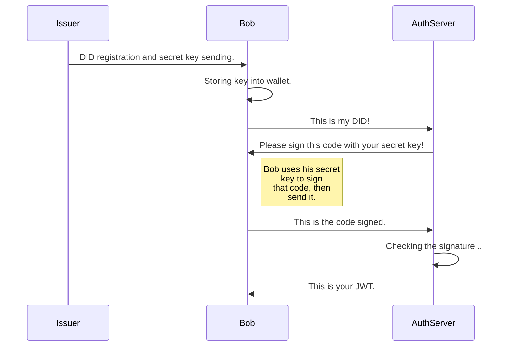

# decentralized-identities-istio

Repository for master thesis' project that implements a new way to use Decentralized Identities, obtained and issued through **Hyperledger Firefly**, to achieve authentication and authorization in Istio service mesh, through JWT tokens.

# Solution's idea
The solution aims to provide to end-user the ability to authenticate himself at an authorization server by exhibiting control over his DID, previously claimed by the responsible department.
The reference idea concerns the **DID Auth** protocol, a 'cryptographic game' prepared to attest ownership of the DID to the user with whom the authentication server has interacted.

The implementation of this cryptographic game involves the authentication server sending a six-digit pseudo-random code to the user. The latter signs with his private key a message containing the previously obtained code and responds to the server; here FireFly comes into play, in fact, the server verifies the signature received by accessing the keys stored on the blockchain and issues a **JWT** token containing the claims of the properties associated with the user, present in the DID document.

About regard the revocation of an identity, the idea is to use a smart contract to implement a registry containing all revoked identities within the organization, which will be consulted by the authentication server, when the cryptographic game succeed, to deduce whether or not to release the JWT.

## Idea's schemas

In this section there are some schema and illustration to give you a visual panoramic of the business flow.

Here we can see more in detail these steps:

  

### Identity Management service

The purpose of this service is to provide the department responsible for managing corporate identities the ability to **insert or revoke** an identity on the blockchain, associated with the corporate information  included in the DID document.

This step initially involves creating an account via the FireFly shell, which will respond with a pair (ethereum address, private key). The key must be provided to the user in a secure manner. The latter will enter it into his wallet on the first run of the DID Authentication service.

To overcome the plain-text of the user's properties, the authentication server exposes a final endpoint /getPublicKey, which provides the public key to be used to encrypt the sensitive information and make it accessible only and exclusively on the authentication server, through **RSA**.

With regard to the revocation of DIDs, the endpoint for the execution of the previously deployed smart contract is contacted, sending as the body of the request the DID that is to be revoked, which, from this instant onwards, will no longer be validated by the server.

### Authentication Server

The server listens on two endpoints, which represent the two phases of the cryptographic game: /sendDid and /sendProof.
The idea is for the user to send its DID when it contacts the first endpoint. In this circumstance, the server generates a code and places it inside a request pool together with the DID, generating a pair (DID, code), before replying with it to the user.
In the last step of the process, the server verifies the signature by comparing the **ethereum address** associated with the DID (available on the blockchain) with the one obtained from the signature received from the user. Next, the **revocation log** is consulted to ascertain the validity of the DID.
If these checks are positive, the JWT token is created by retrieving the user's properties associated with the DID document from the blockchain and inserting them as claims within the token.

### DID Auth service

The client-side implementation of the cryptographic game. So, we start by sending the DID to the authentication server, which will respond with a code.

The latter must be signed with the private key, previously obtained during the registration phase. N.B. At the first execution of the service, the key will be requested to be stored in the wallet.

After signing the key, the client sends the signature to the authentication server, which will be validated by verifying the correspondence of the associated address and the validity of the DID itself.

Following this step, the server will respond with the JWT containing the claims with the user's information on the blockchain.
At this point, the user can use the token to access the **Istio service mesh**.
